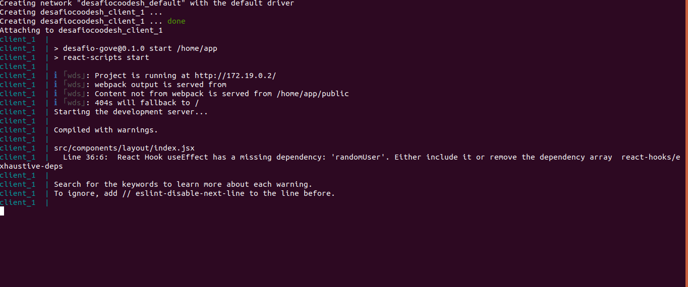
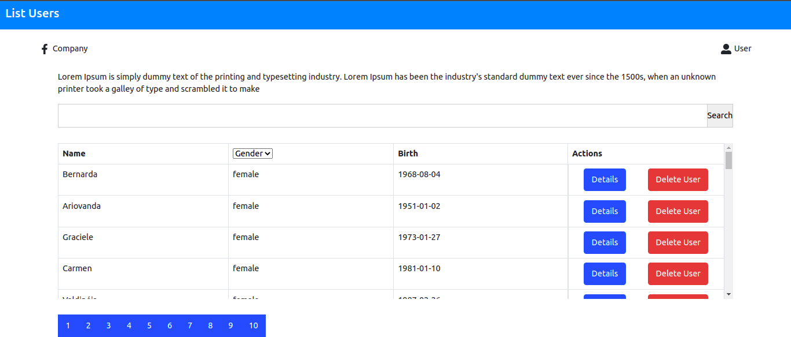

## Desafio front-end

### Descrição

A empresa Pharma Inc, está trabalhando em um projeto em colaboração com sua base de clientes para facilitar a gestão e visualização da informação dos seus pacientes de maneira simples e objetiva em um Dashboard onde podem listar, filtrar e expandir os dados disponíveis.
O seu objetivo nesse projeto, é trabalhar no desenvolvimento do Front end que consumirá a API da empresa Pharma Inc seguindo os requisitos propostos neste desafio.

## Requisitos

Devemos exibir os seguintes campos do paciente:

- Imagem
- Nome completo
- Email
- Gênero
- Data de nascimento
- Telefone
- Nacionalidade
- Endereço
- ID (Número de identificação)

## Tecnologias utilizadas
- React JS
- Styled componens
- Axios
- Bootstrap

## Instalando / Iniciando

Para executar o projeto sua máquina deve conter os requisitos abaixo.

### Pré-requisitos

    node v16.8.0
    npm 7.21.0
    Docker version 20.10.8
    docker-compose version 1.17.1

## Link para download das ferramentas

<a href="https://nodejs.org/en/">Download node js</a>  
<a href="https://docs.docker.com/get-docker/">Download docker</a>

### Rodando o projeto com docker

Para executar o projeto digite o seguinte comando.

    docker-compose up

No seu terminal as seguintes informações.

Escolha a seguinte opção para ver a aplicação em execução

    On Your Network: http://172.21.0.2:4000

## Rodando o projeto sem o docker

    npm install
    npm start

Tente acessar o link abaixo.

    http://localhost:4000

## Imagem do projeto

## Créditos

Esse é um desafio da <a href="https://lab.coodesh.com/public-challenges/front-end-challenge-2021">coodesh</a>, todos os direitos reservados a empresa.